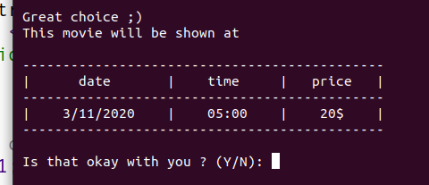
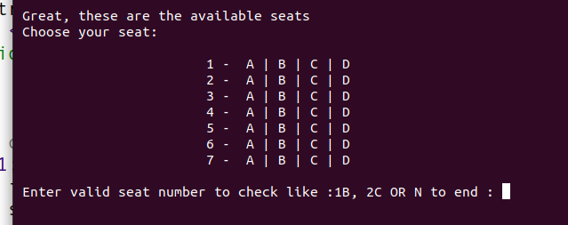
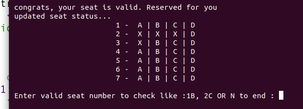
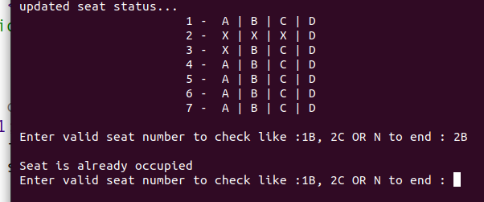
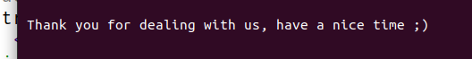

# Movie ticket booking system using c++

  

     
  

  

    
  

#### 1: Main page    
  

#### 2: Movie Release Dates    
  

#### 3: Seat reservation    
  

#### 4: Book more than one seat    
  

#### 5: If you choose seat is already occupied    
  

#### 6: Goodbye page :smiley:    
  

